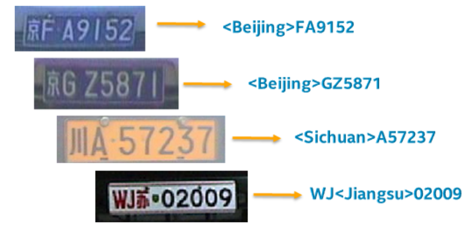

# LPRNet
## 目录
* [LPRNet](#LPRNet)
  * [目录](#目录)
  * [1. 简介](#1-简介)
  * [2. 数据集](#2-数据集)
  * [3. 准备模型与数据](#3-准备模型与数据)
  * [4. 模型编译](#4-模型编译)
    * [4.1 生成FP32 BModel](#41-生成fp32-bmodel)
    * [4.2 生成INT8 BModel](#42-生成int8-bmodel)
  * [5. 例程测试](#5-例程测试)

## 1. 简介

本例程对[LNRNet_Pytorch](https://github.com/sirius-ai/LPRNet_Pytorch)的模型和算法进行移植，使之能在SOPHON BM1684和BM1684X上进行推理测试。

**论文:** [LPRNet: License Plate Recognition via Deep Neural Networks](https://arxiv.org/abs/1806.10447v1)

LPRNet(License Plate Recognition via Deep Neural Networks)，是一种轻量级卷积神经网络，可实现无需进行字符分割的端到端车牌识别。  
LPRNet的优点可以总结为如下三点：  
(1)LPRNet不需要字符预先分割，车牌识别的准确率高、算法实时性强、支持可变长字符车牌识别。对于字符差异比较大的各国车牌均能够端到端进行训练。  
(2)LPRNet是第一个没有使用RNN的实时轻量级OCR算法，能够在各种设备上运行，包括嵌入式设备。  
(3)LPRNet具有足够好的鲁棒性，在视角和摄像畸变、光照条件恶劣、视角变化等复杂的情况下，仍表现出较好的识别效果。 



在此非常感谢Sergey Zherzdev、 Alexey Gruzdev、 sirius-ai等人的贡献。

## 2. 数据集

[LNRNet论文](https://arxiv.org/abs/1806.10447v1)中没有提供数据集的具体来源。[LNRNet_Pytorch](https://github.com/sirius-ai/LPRNet_Pytorch)中提供了一个节选至CCPD的车牌测试集，数量为1000张，图片名为车牌标签，且图片已resize为24x94，本例程以此作为测试集。

[CCPD](https://github.com/detectRecog/CCPD)，是由中科大团队构建的一个用于车牌识别的大型国内停车场车牌数据集。该数据集在合肥市的停车场采集得来，采集时间早上7:30到晚上10:00。停车场采集人员手持Android POS机对停车场的车辆拍照并手工标注车牌位置。拍摄的车牌照片涉及多种复杂环境，包括模糊、倾斜、阴雨天、雪天等等。CCPD数据集一共包含将近30万张图片，每种图片大小720x1160x3。

## 3. 准备模型与数据
Pytorch的模型在编译前要经过`torch.jit.trace`，trace后的模型才能用于编译BModel。trace的方法和原理可参考[torch.jit.trace参考文档](../docs/torch.jit.trace_Guide.md)。

同时，您需要准备用于测试的数据集，如果量化模型，还要准备用于量化的数据集。

本例程在`scripts`目录下提供了相关模型和数据集的下载脚本`download.sh`，您也可以自己准备模型和数据集，并参考[4. 模型转换](#4-模型转换)进行模型转换。
```bash
chmod -R +x scripts/
./scripts/download.sh
```
执行后，模型保存至`data/models`，数据集下载并解压至`data/images/`
```
下载的模型包括：
torch/Final_LPRNet_model.pth: 原始模型
torch/LPRNet_model_trace.pt: trace后的JIT模型
BM1684/lprnet_fp32_1b.bmodel: 用于BM1684的FP32 BModel，batch_size=1
BM1684/lprnet_fp32_4b.bmodel: 用于BM1684的FP32 BModel，batch_size=4
BM1684/lprnet_int8_1b.bmodel: 用于BM1684的INT8 BModel，batch_size=1
BM1684/lprnet_int8_4b.bmodel: 用于BM1684的INT8 BModel，batch_size=4
BM1684X/lprnet_fp32_1b.bmodel: 用于BM1684X的FP32 BModel，batch_size=1
BM1684X/lprnet_fp32_4b.bmodel: 用于BM1684X的FP32 BModel，batch_size=4
BM1684X/lprnet_int8_1b.bmodel: 用于BM1684X的INT8 BModel，batch_size=1
BM1684X/lprnet_int8_4b.bmodel: 用于BM1684X的INT8 BModel，batch_size=4
下载的数据包括：
test: 测试集
test_label.json：test测试集的标签文件
test_md5_lmdb: 用于量化的lmdb数据集
```
模型信息：

| 原始模型 | Final_LPRNet_model.pth  | 
| ------- | ----------------------   |
| 概述     | 基于ctc的车牌识别模型，支持蓝牌、新能源车牌等中国车牌，可识别字符共67个。| 
| 骨干网络 | LPRNet                   | 
| 训练集   | 未说明                    | 
| 运算量   | 148.75 MFlops            |
| 输入数据 | [batch_size, 3, 24, 94], FP32，NCHW |
| 输出数据 | [batch_size, 68, 18], FP32 |
| 前处理   | resize,减均值,除方差,HWC->CHW |
| 后处理   | ctc_decode                 |


## 4. 模型编译

trace后的pytorch模型需要编译成BModel才能在SOPHON TPU上运行，如果使用下载好的BModel可跳过本节。

模型编译前需要安装TPU-NNTC，具体可参考[tpu-nntc环境搭建](../docs/Environment_Install_Guide.md#1-tpu-nntc环境搭建)。

### 4.1 生成FP32 BModel

pytorch模型编译为FP32 BModel，具体方法可参考TPU-NNTC开发参考手册。

本例程在`scripts`目录下提供了编译FP32 BModel的脚本。请注意修改`gen_fp32bmodel.sh`中的JIT模型路径、生成模型目录和输入大小shapes等参数，并在执行时指定BModel运行的目标平台（支持BM1684和BM1684X），如：

```bash
./scripts/gen_fp32bmodel.sh BM1684X
```

执行上述命令会在`data/models/BM1684X/`下生成`lprnet_fp32_1b.bmodel、lprnet_fp32_4b.bmodel、`文件，即转换好的FP32 BModel。


### 4.2 生成INT8 BModel

不量化模型可跳过本节。

pytorch模型的量化方法可参考TPU-NNTC开发参考手册。

本例程在`scripts`目录下提供了量化INT8 BModel的脚本。请注意修改`gen_int8model.sh`中的JIT模型路径、生成模型目录和输入大小shapes等参数，在执行时输入BModel的目标平台（支持BM1684和BM1684X），如：

```shell
./scripts/gen_int8bmodel.sh BM1684X
```

上述脚本会在`data/models/BM1684X`下生成`lprnet_int8_4b.bmodel、lprnet_int8_1b.bmodel`文件，即转换好的INT8 BModel。

> **LPRNet模型量化建议：**   
1.制作lmdb量化数据集时，通过convert_imageset.py完成数据的预处理，将bgr2rgb设成True；  
2.尝试不同的iterations进行量化可能得到较明显的精度提升；  
3.对输入输出层x.1、237保留浮点计算可能得到较明显的精度提升。

## 5. 例程测试
* [C++例程](cpp/README.md)
* [Python例程](python/README.md)